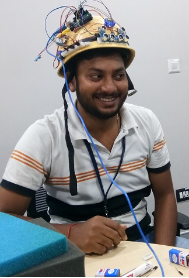

# Smart-Assistant-for-Visually-Impaired
Smart-Assistant-for-Visually-Impaired

## Find the high-level approach on how we are going to solve this challenge as below:

We will use a Raspberry Pi which is connected to sensors, through which it determines any obstructions. This sensor data will be wirelessly communicated to a server via Wi-Fi. The device will also include a help button that will send an emergency text message to an emergency contact with just a simple press of a button by the user.

The core features which we are going to demonstrate as listed below:
1. Object  Detection/Recognition
2. Haptic Direction

## Novel Aspects of the solution:

Innovative design of a system that assists local navigation for blind and visually impaired people by providing 
1. generic feedback on obstacles and 
2. descriptions of identified useful objects.

## Advantages of the solution:

Guide users with visual impairments/obstructions while monitoring their environment.
Dhristi's biggest features including "Can I Cross" and "What Do I See".

## Prototype Model - Haptic Feedback

